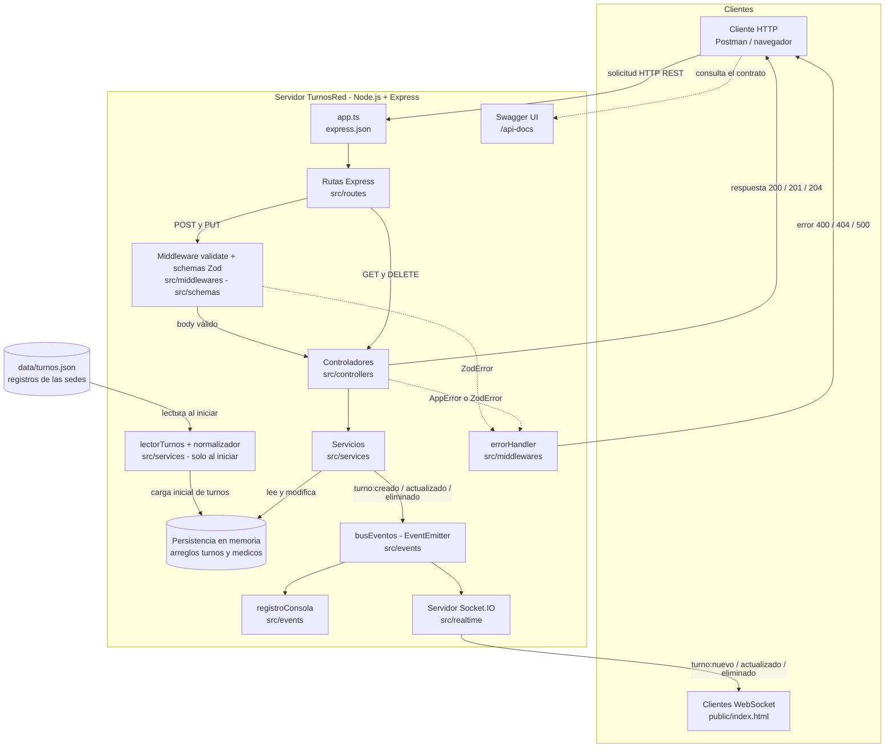
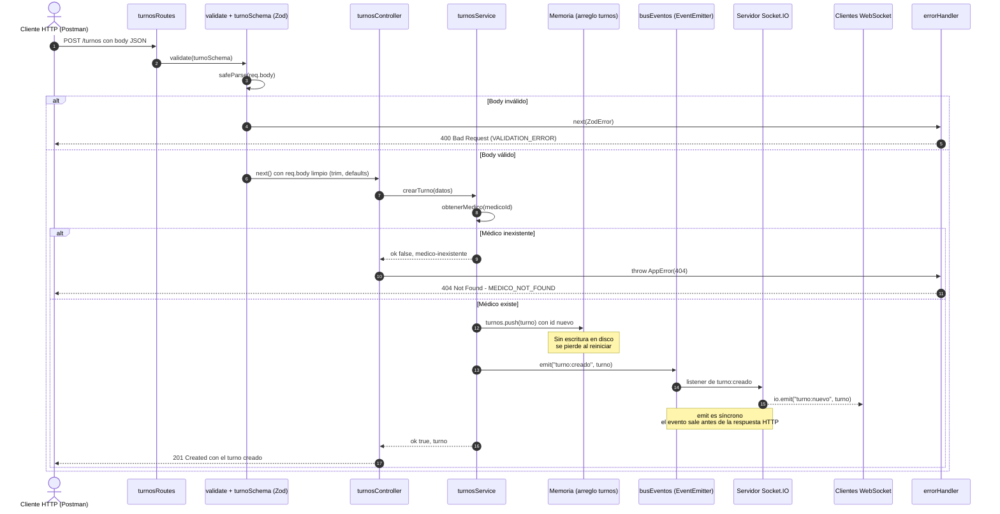

# TurnosRed

Prototipo de backend para centralizar la gestion de turnos medicos de varios centros de atencion ambulatoria (clinica medica, pediatria, odontologia y nutricion).

El servidor lee los registros que envian las sedes en formato JSON (con formatos inconsistentes), los **normaliza**, y expone una **API RESTful** con Express para gestionar **turnos** y **medicos**. Toda entrada de datos se valida con **Zod**, todos los errores responden con un **formato JSON estandar**, y los cambios en los turnos se **notifican en tiempo real** mediante Socket.IO.

Proyecto desarrollado para las Actividades 1, 2 y 3 del ramo *Integraciones Web*.

## Tecnologias

- Node.js 24 (LTS) + TypeScript
- Express 5 (API REST)
- Zod 4 (validacion de datos en tiempo de ejecucion)
- Socket.IO (comunicacion en tiempo real)
- EventEmitter de Node.js (bus de eventos internos)
- ESLint + Prettier (calidad y formato de codigo)
- Postman (pruebas automatizadas y Mock Server)
- Swagger/OpenAPI 3.0 con swagger-jsdoc y swagger-ui-express (documentacion interactiva)
- Mermaid (diagramas de arquitectura como codigo)

## Requisitos previos

- [NVM](https://github.com/nvm-sh/nvm) para gestionar la version de Node.js
- Node.js **v24.21.0** (definida en `.nvmrc`)
- npm (se instala junto con Node.js)
- Git
- [Postman](https://www.postman.com/downloads/) para ejecutar la coleccion de pruebas

## Instalacion y ejecucion

```bash
# 1. Clonar el repositorio
git clone https://github.com/vaneerc-pr/turnos-red.git
cd turnos-red

# 2. Usar la version de Node.js del proyecto
nvm install
nvm use

# 3. Instalar dependencias (versiones exactas desde package-lock.json)
npm install

# 4. Crear el archivo de variables de entorno a partir de la plantilla
cp .env.example .env

# 5. Compilar y ejecutar
npm run build
npm start
```

El servidor queda disponible en `http://localhost:3000`.

> Cada cambio en `src/` requiere detener el servidor (`Ctrl + C`), ejecutar `npm run build` y volver a ejecutar `npm start`.
> Si aparece el error `EADDRINUSE`, hay otro proceso usando el puerto: se puede liberar con `kill $(lsof -ti :3000)`.

## Variables de entorno

| Variable      | Descripcion                                                  | Valor de ejemplo   |
|---------------|--------------------------------------------------------------|--------------------|
| `PORT`        | Puerto en el que escucha el servidor                         | `3000`             |
| `RUTA_TURNOS` | Ruta (relativa a la raiz del proyecto) del archivo de turnos | `data/turnos.json` |

El archivo `.env` esta excluido del repositorio mediante `.gitignore`. Se debe crear a partir de `.env.example`.

## Scripts disponibles

| Script           | Comando                 | Descripcion                                                    |
|------------------|-------------------------|----------------------------------------------------------------|
| `npm run build`  | `tsc`                   | Compila el codigo TypeScript de `src/` a JavaScript en `dist/` |
| `npm start`      | `node dist/index.js`    | Ejecuta el servidor compilado                                  |
| `npm run lint`   | `eslint . --ext .ts`    | Analiza el codigo en busca de errores y malas practicas        |
| `npm run format` | `prettier --write src/` | Aplica formato homogeneo al codigo fuente                      |

## Estructura del proyecto

Toda la arquitectura en capas esta nombrada en ingles (`routes`, `controllers`, `services`, `schemas`, `models`).

```
turnos-red/
|-- docs/
|   |-- adr/                        # Registros de decisiones de arquitectura (ADRs)
|-- data/
|   |-- turnos.json                 # Datos crudos enviados por las sedes
|-- public/
|   |-- index.html                  # Cliente web de prueba (Socket.IO)
|-- src/
|   |-- config/
|   |   |-- swagger.ts              # Definicion OpenAPI y esquemas reutilizables (Swagger)
|   |-- controllers/
|   |   |-- turnosController.ts     # Traduce el resultado del servicio a una respuesta HTTP
|   |   |-- medicosController.ts
|   |-- errors/
|   |   |-- AppError.ts             # Error con codigo HTTP, codigo de texto y detalles
|   |-- events/
|   |   |-- busEventos.ts           # Bus de eventos internos (EventEmitter)
|   |   |-- registroConsola.ts      # Oyente que registra los eventos en consola
|   |-- middlewares/
|   |   |-- errorHandler.ts         # Unico lugar que responde errores (formato estandar)
|   |   |-- validate.ts             # Valida req.body con un schema de Zod
|   |-- models/
|   |   |-- turno.ts                # Interfaces TurnoCrudo y Turno
|   |   |-- medico.ts               # Interfaz Medico
|   |-- realtime/
|   |   |-- socket.ts               # Puente entre el bus de eventos y Socket.IO
|   |-- routes/
|   |   |-- turnosRoutes.ts         # Metodo + ruta + validacion + controlador, con anotaciones @openapi
|   |   |-- medicosRoutes.ts
|   |-- schemas/
|   |   |-- especialidad.ts         # Especialidades validas del sistema (enum)
|   |   |-- turnoSchema.ts          # Schemas Zod del body y de los filtros de turnos
|   |   |-- medicoSchema.ts         # Schemas Zod del body y de los filtros de medicos
|   |-- services/
|   |   |-- lectorTurnos.ts         # Lectura asincrona del archivo (fs/promises)
|   |   |-- normalizador.ts         # Limpieza de los registros de las sedes
|   |   |-- turnosService.ts        # Logica de negocio, filtros y datos en memoria
|   |   |-- medicosService.ts
|   |-- utils/
|   |   |-- leerId.ts               # Valida el parametro :id (compartido)
|   |   |-- normalizarTexto.ts      # Compara textos sin tildes ni mayusculas
|   |-- app.ts                      # Configuracion de Express
|   |-- index.ts                    # Punto de entrada
|-- turnos-red.postman_collection.json
|-- .env.example
|-- .gitignore
|-- .nvmrc
|-- .prettierrc
|-- eslint.config.mjs
|-- package.json
|-- package-lock.json
|-- tsconfig.json
```

**Flujo de una solicitud:**

```
Cliente HTTP -> routes -> validate (Zod) -> controllers -> services -> datos en memoria
                              |                 |              |
                              +--- errores -----+--------------+--> errorHandler -> respuesta JSON estandar
                                                               |
                                                               +-> busEventos -+-> registro en consola
                                                                               +-> Socket.IO -> clientes
```

Cada capa tiene una sola responsabilidad:

- **routes**: asocian el metodo HTTP y la ruta con la validacion y el controlador.
- **validate**: revisa el body con Zod antes de llegar al controlador; si es invalido, el controlador no se ejecuta.
- **controllers**: leen la solicitud, llaman al servicio y deciden el codigo de estado. No contienen logica de negocio.
- **services**: aplican la logica de negocio (por ejemplo, verificar que el medico de un turno exista) y los filtros. No conocen HTTP.
- **errorHandler**: convierte cualquier error en una respuesta con formato estandar.

## Arquitectura

Los diagramas estan escritos en [Mermaid](https://mermaid.js.org/) dentro de este README (*Docs as Code*): GitHub los renderiza automaticamente y se versionan junto con el codigo.

### Diagrama de componentes

Representa la arquitectura real de la aplicacion. Los datos se mantienen **en memoria**: `data/turnos.json` solo se lee al iniciar el servidor para la carga inicial de los turnos de las sedes, y los medicos iniciales estan definidos en `medicosService`. Ninguna operacion de la API escribe en archivos JSON (ver [Limitaciones conocidas](#limitaciones-conocidas)).



### Diagrama de secuencia: `POST /turnos`

Flujo completo de creacion de un turno, incluyendo los casos de error 400 (validacion de Zod) y 404 (medico inexistente).



## Decisiones de arquitectura (ADRs)

Las decisiones tecnicas relevantes se registran en [`docs/adr`](docs/adr) como *Architecture Decision Records*:

| ADR | Decision | Estado |
|-----|----------|--------|
| [ADR-001](docs/adr/ADR-001-uso-de-openapi.md) | Uso de OpenAPI (Swagger) como estandar de documentacion del contrato de la API | Aceptado |
| [ADR-002](docs/adr/ADR-002-adopcion-futura-de-jwt.md) | Adopcion futura de JWT para autenticacion y autorizacion | Propuesto |

## Formato estandar de errores

Todas las respuestas fallidas de la API tienen la misma estructura:

```json
{
  "status": 400,
  "message": "Error de validacion en los datos ingresados",
  "code": "VALIDATION_ERROR",
  "details": [
    { "field": "fecha", "message": "La fecha debe tener formato AAAA-MM-DD y ser valida" }
  ]
}
```

| `code`             | Estado | Cuando ocurre                                                    |
|--------------------|--------|------------------------------------------------------------------|
| `VALIDATION_ERROR` | 400    | El body o los query params no cumplen el schema de Zod           |
| `INVALID_ID`       | 400    | El `:id` de la URL no es un entero positivo                      |
| `INVALID_JSON`     | 400    | El body no es un JSON valido                                     |
| `NOT_FOUND`        | 404    | El turno o medico solicitado no existe                           |
| `MEDICO_NOT_FOUND` | 404    | Se intenta crear o actualizar un turno con un `medicoId` inexistente |
| `ROUTE_NOT_FOUND`  | 404    | La ruta solicitada no existe                                     |
| `INTERNAL_ERROR`   | 500    | Error inesperado del servidor (el detalle solo se registra en consola) |

`details` indica exactamente que campo fallo y por que. Si no aplica, es un arreglo vacio.

## Endpoints

La documentacion interactiva completa (parametros, cuerpos, respuestas y esquemas) esta disponible con el servidor en ejecucion en **`http://localhost:3000/api-docs`**, y la especificacion OpenAPI en JSON en `/api-docs.json`.

### Turnos

| Metodo | Ruta          | Descripcion                          | Codigos            |
|--------|---------------|--------------------------------------|--------------------|
| GET    | `/turnos`     | Lista los turnos (admite filtros)    | 200, 400           |
| GET    | `/turnos/:id` | Obtiene un turno por su id           | 200, 400, 404      |
| POST   | `/turnos`     | Crea un turno                        | 201, 400, 404      |
| PUT    | `/turnos/:id` | Reemplaza un turno completo          | 200, 400, 404      |
| DELETE | `/turnos/:id` | Elimina un turno (respuesta sin body) | 204, 400, 404     |

**Body de POST y PUT:**

```json
{
  "paciente": "Carlos Ruiz",
  "documento": "31.654.210-K",
  "especialidad": "Pediatría",
  "fecha": "2026-08-14",
  "hora": "10:00",
  "medicoId": 1,
  "confirmado": false,
  "observaciones": "Opcional"
}
```

| Campo           | Regla de validacion                                                         |
|-----------------|-----------------------------------------------------------------------------|
| `paciente`      | Texto no vacio (se eliminan espacios sobrantes)                             |
| `documento`     | Texto no vacio; se acepta como string para admitir formatos flexibles       |
| `especialidad`  | Exactamente una de: `Clínica médica`, `Pediatría`, `Odontología`, `Nutrición` |
| `fecha`         | Formato `AAAA-MM-DD` y fecha real (rechaza `2026-02-30`)                     |
| `hora`          | Formato `HH:MM` entre `00:00` y `23:59`                                      |
| `medicoId`      | Entero positivo; el medico debe existir (si no, 404 `MEDICO_NOT_FOUND`)      |
| `confirmado`    | Booleano; opcional, por defecto `false`                                     |
| `observaciones` | Texto opcional                                                              |

`PUT` reemplaza el recurso completo, por lo que exige todos los campos obligatorios.

### Medicos

| Metodo | Ruta           | Descripcion                           | Codigos       |
|--------|----------------|---------------------------------------|---------------|
| GET    | `/medicos`     | Lista los medicos (admite filtros)    | 200, 400      |
| GET    | `/medicos/:id` | Obtiene un medico por su id           | 200, 400, 404 |
| POST   | `/medicos`     | Registra un medico                    | 201, 400      |
| PUT    | `/medicos/:id` | Reemplaza la informacion de un medico | 200, 400, 404 |
| DELETE | `/medicos/:id` | Da de baja un medico                  | 204, 400, 404 |

**Body de POST y PUT:**

```json
{
  "nombre": "Paula Rivas",
  "especialidad": "Pediatría",
  "disponible": true
}
```

`nombre` es texto no vacio, `especialidad` usa las mismas cuatro opciones que turnos y `disponible` es booleano. Los campos que no estan en el schema se descartan.

## Filtros mediante query params

Los filtros se implementan en la capa de servicios sobre los mismos endpoints `GET /turnos` y `GET /medicos`, sin crear rutas adicionales. Se pueden combinar libremente.

| Recurso    | Parametro      | Formato aceptado                                    |
|------------|----------------|-----------------------------------------------------|
| `/turnos`  | `especialidad` | Texto; no distingue tildes ni mayusculas            |
| `/turnos`  | `fecha`        | `AAAA-MM-DD` o `DD/MM/AAAA`                          |
| `/turnos`  | `medicoId`     | Entero positivo                                     |
| `/medicos` | `especialidad` | Texto; no distingue tildes ni mayusculas            |
| `/medicos` | `disponible`   | `true` o `false`                                    |

**Ejemplos:**

```
GET /turnos?especialidad=Pediatria&fecha=14/08/2026
GET /turnos?fecha=2026-08-14
GET /turnos?medicoId=2
GET /turnos?especialidad=odontologia&medicoId=2
GET /medicos?especialidad=Odontologia&disponible=true
GET /medicos?disponible=false
```

**Decision de diseno:** el body se valida de forma **estricta** (lo que se guarda debe tener el formato exacto), mientras que los filtros son **tolerantes**, porque son criterios de busqueda: `Pediatria` encuentra los turnos guardados como `Pediatría`, y `14/08/2026` se convierte a `2026-08-14` antes de comparar.

Los valores invalidos responden 400 con el formato estandar (por ejemplo, `?disponible=si` o `?fecha=31/02/2026`). El filtro `disponible` acepta solo los textos `true` y `false`, ya que convertir el texto con `Boolean()` transformaria `"false"` en `true`.

## Pruebas con Postman

La coleccion `turnos-red.postman_collection.json` contiene 23 solicitudes organizadas en tres carpetas: *1. Medicos*, *2. Turnos* y *3. Limpieza*.

**Entornos:**

| Variable   | Uso                                                                                      |
|------------|------------------------------------------------------------------------------------------|
| `baseUrl`  | URL de la API: `http://localhost:3000` (entorno Local) o la URL del Mock Server (entorno Mock) |
| `medicoId` | Se guarda automaticamente al crear un medico y la usan las solicitudes siguientes        |
| `turnoId`  | Se guarda automaticamente al crear un turno                                              |
| `token`    | Reservada para autenticacion futura; la API aun no requiere autenticacion               |

Ademas, el paciente del turno de prueba usa la variable dinamica `{{$randomFullName}}` de Postman, que genera un nombre distinto en cada ejecucion.

**Pruebas automatizadas:** cada solicitud verifica su codigo de estado (200, 201, 204, 400 o 404) y valida el esquema JSON de la respuesta con `pm.response.to.have.jsonSchema`. Un script a nivel de coleccion verifica que toda respuesta con error cumpla el formato estandar. La coleccion cubre el *happy path* (crear, consultar, filtrar, actualizar y eliminar) y casos de error (validaciones de Zod, ids invalidos, recursos inexistentes y filtros invalidos).

**Ejecutar las pruebas:**

1. Iniciar el servidor (`npm run build && npm start`).
2. Importar la coleccion en Postman y crear un entorno con `baseUrl = http://localhost:3000`.
3. Seleccionar el entorno y ejecutar la coleccion con *Run collection*. Resultado: 65 de 65 tests aprobados.

**Mock Server:** cada solicitud tiene guardada su respuesta real como ejemplo (*Saved Response*), lo que permite crear un Mock Server de Postman a partir de la coleccion. El header `x-mock-response-code` indica al Mock que ejemplo devolver cuando una misma ruta tiene varios (por ejemplo, 200 antes de eliminar un turno y 404 despues). La API real ignora este header.

## Eventos en tiempo real

| Evento interno (EventEmitter) | Evento emitido a clientes (Socket.IO) |
|-------------------------------|---------------------------------------|
| `turno:creado`                | `turno:nuevo`                         |
| `turno:actualizado`           | `turno:actualizado`                   |
| `turno:eliminado`             | `turno:eliminado`                     |

Para probarlo, abrir `http://localhost:3000` en el navegador y realizar operaciones desde Postman: la tabla se actualiza sin recargar la pagina.

## Normalizacion de datos de las sedes

Al iniciar, los registros de `turnos.json` se transforman al modelo `Turno`:

- `id`: convertido a numero; debe ser entero positivo.
- `paciente`: sin espacios sobrantes y con mayuscula inicial en cada palabra.
- `documento`: convertido a texto, solo digitos.
- `especialidad`: unificada a una de las cuatro especialidades validas.
- `fecha`: formato `AAAA-MM-DD`. `hora`: formato `HH:MM`.
- `confirmado`: convertido a booleano (`si` / `no` / `true` / `false`).

Los registros que no pueden normalizarse se descartan, y se informa por consola la cantidad de registros aceptados y rechazados.

La normalizacion se aplica **solo a los archivos de las sedes**. Los datos que llegan por la API no se corrigen: se validan con Zod y, si no cumplen el formato, se rechazan con 400.

## Limitaciones conocidas

- Los datos se mantienen **en memoria**: al reiniciar el servidor se pierden los cambios realizados mediante la API.
- Los turnos cargados desde las sedes no tienen `medicoId`, porque los archivos de origen no incluyen ese dato.
- La API no impide turnos superpuestos (mismo paciente, fecha y hora).
- La API no tiene autenticacion.
- La capitalizacion de nombres no contempla particulas (por ejemplo, "de la" queda como "De La").

## Uso de Inteligencia Artificial

Durante las Actividades 2 y 3 se utilizo Claude (Anthropic, claude.ai) como asistente de desarrollo y documentacion. Todo el codigo y la documentacion generados fueron revisados, compilados (`tsc`) y verificados (navegador, `curl`, Postman y GitHub) antes de cada commit. La columna *Solicitud realizada* resume lo que se pidio en cada caso.

### Actividad 2

| Tarea | Herramienta | Solicitud realizada (resumen) | Respuesta generada | Ajuste manual aplicado |
|-------|-------------|-------------------------------|--------------------|------------------------|
| Analisis de las consignas | Claude | Analisis de las consignas de la Actividad 2 a partir del Modulo 2 y plan para desarrollarlas en orden | Explicacion de que significa refactorizar, tabla de codigos de estado esperados por endpoint y plan de trabajo | Se reviso el codigo existente de la Actividad 1 contra la tabla antes de modificarlo |
| Middleware de errores | Claude | Guia paso a paso para implementar un middleware de errores con un formato de respuesta unico | Clase `AppError` y middleware `errorHandler` con formato `{ status, message, code, details }` | Se incorporo la verificacion `res.headersSent` del manejador original de la Actividad 1, que la propuesta no incluia |
| Refactor del controlador de turnos | Claude | Revision del codigo de turnos (rutas, controlador y servicio) para ajustarlo a verbos y codigos HTTP estrictos | Controlador que lanza `AppError` en lugar de responder errores manualmente; DELETE con 204 | Se verifico cada codigo de estado con `curl` (400, 404, 204) antes del commit |
| CRUD de medicos | Claude | Consulta sobre como desarrollar el CRUD del recurso Medico manteniendo la arquitectura en capas del proyecto | Modelo, servicio, controlador y rutas de medicos; extraccion de `leerId` a `utils` | Se definieron los campos `especialidad` y `disponible` en funcion de los filtros de la consigna 4; se probaron los 5 endpoints con `curl` |
| Schemas Zod | Claude | Consulta sobre como validar Turno y Medico con Zod e integrar los errores de validacion al formato estandar | Schemas de turno y medico, enum de especialidades, middleware `validate` e integracion de `ZodError` en el `errorHandler` | Se corrigio el modelo `Turno` para que `medicoId` fuera opcional (los turnos de las sedes no lo traen), tras un error de compilacion |
| Filtros por query params | Claude | Consulta sobre como implementar filtros combinables por query params sin crear endpoints adicionales | Schemas de filtros, funcion `normalizarTexto` y filtros en la capa de servicios | Se verifico el ejemplo literal del enunciado (`Pediatria`, `14/08/2026`) y el caso `disponible=false` |
| Coleccion de Postman | Claude | Apoyo para construir la coleccion de Postman con pruebas automatizadas y ejemplos para Mock Server | Coleccion con 23 solicitudes, tests de estado y esquema JSON, variables encadenadas y ejemplos para el Mock Server | Se importo y ejecuto contra la API real (65/65 tests); se creo y configuro el Mock Server y su entorno manualmente en Postman |
| README | Claude | Actualizacion del README de la Actividad 1 con los cambios de la segunda etapa | Version actualizada con endpoints, filtros, formato de errores, pruebas y esta seccion | Revision final del contenido |

### Actividad 3

| Tarea | Herramienta | Solicitud realizada (resumen) | Respuesta generada | Ajuste manual aplicado |
|-------|-------------|-------------------------------|--------------------|------------------------|
| Analisis del enunciado frente al codigo | Claude | Mapeo de las consignas de la Actividad 3 y comparacion de lo que asume el enunciado con el comportamiento real del repositorio | Mapa de consignas y tres diferencias: persistencia en memoria (no en JSON), nombres de eventos (`turno:creado` interno / `turno:nuevo` externo) y filtros reales de `GET /medicos` | Se revisaron `socket.ts`, `turnosService.ts` y los schemas para confirmar cada diferencia; se decidio documentar el comportamiento real del backend y no el supuesto del enunciado |
| Anotaciones JSDoc y esquemas OpenAPI | Claude | Integracion de swagger-jsdoc y swagger-ui-express y documentacion de los 10 endpoints con esquemas reutilizables | `src/config/swagger.ts`, anotaciones `@openapi` en las rutas y montaje de `/api-docs` y `/api-docs.json` | Se instalaron las dependencias, se compilo y se verifico la interfaz `/api-docs` en el navegador; se documentaron los filtros reales de `GET /medicos` (`especialidad`, `disponible`) |
| Sintaxis Mermaid | Claude | Diagramas de componentes y de secuencia de `POST /turnos` que representen la arquitectura real | Seccion *Arquitectura* del README con ambos diagramas | Se verifico el renderizado en GitHub: se cambio la orientacion de `LR` a `TB` por legibilidad y, al detectar etiquetas cortadas, se configuro `htmlLabels: false` y se acortaron los textos |
| Plantillas ADR | Claude | Redaccion de los ADRs de OpenAPI (Aceptado) y JWT (Propuesto) con la estructura obligatoria | `ADR-001-uso-de-openapi.md`, `ADR-002-adopcion-futura-de-jwt.md` y tabla de ADRs en el README | Se ubicaron en `docs/adr` y se reviso que el contenido corresponda a la implementacion real (por ejemplo, que JWT depende de resolver antes la persistencia) |
| Verificacion de coherencia documental | Claude | Verificacion cruzada entre controladores, schemas de Zod, especificacion OpenAPI y coleccion de Postman | Matriz de verificacion basada en 28 solicitudes reales y comparacion de schemas | Se ejecuto la coleccion en el Runner de Postman (65/65 tests) para confirmar los resultados |
